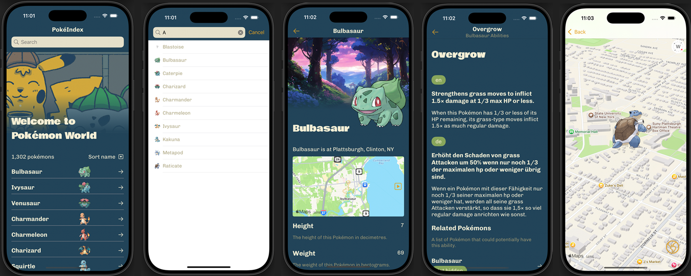

<div id="top"></div>

<!-- PROJECT LOGO -->
<br />
<div align="center">


<h3 align="center">PokéIndex</h3>

<p align="center">A SwiftUI PokéIndex App using PokéAPI</p>

  <p align="center">
    <br />
    <a href="https://github.com/LynnHaDo/Pokemon-Index/issues">Report Bug</a>
    ·
    <a href="https://github.com/LynnHaDo/Pokemon-Index/issues">Request Feature</a>
  </p>
</div>

<!-- TABLE OF CONTENTS -->
<details>
  <summary>Table of Contents</summary>
  <ol>
    <li>
      <a href="#demo">Demo</a>
    </li>
    <li>
      <a href="#about-the-project">About The Project</a>
      <ul>
        <li><a href="#features">Features</a></li>
        <li><a href="#built-with">Built With</a></li>
      </ul>
    </li>
    <li>
      <a href="#getting-started">Getting Started</a>
      <ul>
        <li><a href="#build-locally">Build Locally</a></li>
      </ul>
    </li>
    <li><a href="#contact">Contact</a></li>
  </ol>
</details>

<!-- UPDATES -->
## Demo

<div align="center">
    <video src="https://github.com/user-attachments/assets/f747f13d-97a3-4d87-b89e-c41901fb85e5" width="320">
</div>

### Screen layouts



<p align="center">iPhone 16 Pro</p>

<!-- ABOUT THE PROJECT -->
## About The Project

This is my (second) attempt at making a SwiftUI app! I created a simple Pokémon characters index app that fetches Pokémons from the [PokéAPI](https://pokeapi.co/docs/v2). 

Right now, the app fetches data from the API and render that to view. However, the next goal is to migrate the data from the API into Core Data models—for better management and maintenance of data. 

<p align="right">(<a href="#top">back to top</a>)</p>

### Progress

- [x] Fetch data from PokéAPI and display all Pokémons
    - [x] Add functionality to sort the Pokémons by name 
- [x] Render details for each Pokémon:
    - [x] Basic info
    - [x] Image 
    - [x] Abilities 
        - [x] Display Pokémons with similar abilities
    - [x] Location 
        - [x] Fetch US Locations from [US Cities Database](https://simplemaps.com/data/us-cities)
        - [x] Add a random offset to each Pokémon for more varying location pins on the map 
- [x] Add search bar 
- [x] Render a map (normal and satellite view) with all pokemons 
- [x] Add a sticker pack to the app

<p align="right">(<a href="#top">back to top</a>)</p>

### Built With

- XCode 16.2
- [SwiftUI](https://developer.apple.com/xcode/swiftui/)
- [PokéAPI](https://pokeapi.co/docs/v2)
- [MapKit](https://developer.apple.com/documentation/mapkit/mapkit-for-swiftui)
- [US Cities Database](https://simplemaps.com/data/us-cities)

<p align="right">(<a href="#top">back to top</a>)</p>

<!-- GETTING STARTED -->

## Getting Started

### Build locally

Clone the repo

```
git clone https://github.com/LynnHaDo/Pokemon-Index.git
```

<p align="right">(<a href="#top">back to top</a>)</p>

<!-- Contact -->

## Contact

Email: <a href="mailto:do24l@mtholyoke.edu">do24l@mtholyoke.edu</a>
